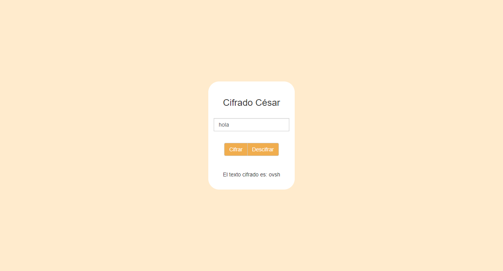

# Cifrado César
## Descripción
Este repositorio contiene una página web en donde el usuario podrá escribir un mensaje y elegir `cifrar` o `descrifrar` según el algoritmo de Cifrado César con el parámetro de desplazamiento de 33 espacios hacia la derecha.

Por ejemplo:

+ Texto original: ABCDEFGHIJKLMNOPQRSTUVWXYZ
+ Texto codificado: HIJKLMNOPQRSTUVWXYZABCDEFG

## Producto Final

## Herramientas
`HTML5`  `CSS3`  `JavaScript`  `jQuery`  `Bootstrap`  `ES6`
